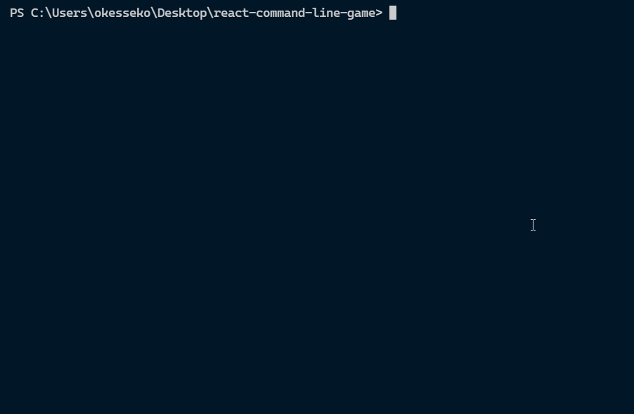

# React command line game



This is a React quiz game.
There are ten questions in total.
Each question consists of one question and three options.
You need to choose the correct answer from three 

## Play by npx
use this way, you don't need to clone the project
```shell=
npx react-command-line-game
```

## Play by project or development
clone the project
```git=
git clone https://github.com/okesseko/react-command-line-game.git
```
install node modules
```shell=
npm install
```
enjoy the game
```shell=
node .
```